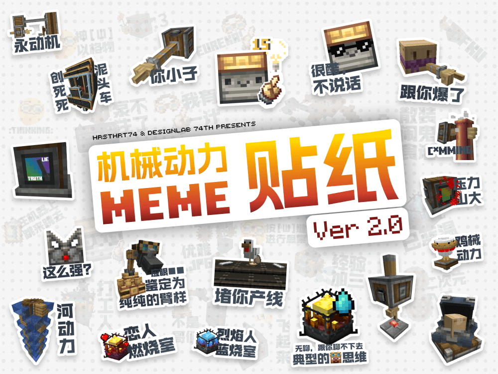

  
  
  
  

###### Note: README is now only available in Chinese. English ver coming s∞n (PR is welcomed)

> [!TIP]
> Ver. 2.0 现已发布，新增了 22 张贴纸，欢迎下载~

一套以 Minecraft 模组「[机械动力](https://github.com/Creators-of-Create/Create)」为主题的 meme 贴纸。灵感来自社区，并融合了部分流行 meme 元素。希望它能给你带来一些快乐 :)

## 注意事项
- **本贴纸使用了不可免费商用的字体（锐字锐线怒放大黑简），禁止商用！！**
  
  此外，本贴纸用到的「Minecraft Ten」字体，目前作者并不明确其是否可以免费商用，因此还是禁止贴纸商用！
- 本贴纸为饭制（Fanmade），其表达的内容 / 观点均与 Microsoft、Mojang Studios、Creators of Create 无关
- 本项目使用了 [Creators-of-Create/Create](https://github.com/Creators-of-Create/Create) 的部分资产
- 本项目参考了 [misbrands](https://github.com/mkrl/misbrands) 项目
- 本项目参考了 [llm-things](https://github.com/fenxer/llm-things) 项目
- 本项目使用了 [Twimoji](https://github.com/twitter/twemoji)
- 本项目使用了 [Thirst was Taken](https://github.com/ghen-git/Thirst-Mod?tab=License-1-ov-file#readme) 的部分资产（`thirst_icons.png`）

## FAQ
- **可以自印吗？**
  
  可以。但禁止售卖 / 盗卖。 ~~盗卖小心麻麻被抓走~~
  
  如果你在中国大陆的话，可以试试柔造。（不是广告哈）

- **可以做表情包吗？**
  
  可以，虽然本项目本身并不是为表情包设计的

- **可以二创吗？**
  
  可以。二创时请保留原作者及原项目信息 :)

- **可以加 XX 贴纸吗？/ 我有个想法！**

  请提出 issues，或者欢迎 PR 提交你的贴纸文件。（请尽量与原贴纸的风格保持一致。）

## 自制建议（设计规范）
- 此项目是**贴纸**，实物的那种，并不是表情包。制作时请优先考虑贴纸的呈现效果
- 游戏内的 UI 未必适合贴纸，建议手搓一套 UI（例：泵不注了）

- 图案和文字请尽量撑满画板
- 文字请不要使用黑色，建议使用 PS 渐变色里灰色的第 12 个预设
- 非必要不要加描边（例外：聪明的物品侦测器）

- 使用与已经做好的贴纸相同的字体（中文 锐字锐线怒放大黑简、英文 Minecraft Ten）
- Emoji 请使用 [Twimoji](https://github.com/twitter/twemoji)
- 请考图案与文字重合时的情况，图同时与两行文字重合时建议：第一行 图案在上，第二行 文字在上（善用 PS 蒙版功能）
- 中文的字间距为 0，英文为 -60
- 中文的行间距应比字间距略大

- 如需放大 16x16 的纹理的话，请使用 PS 的「图像大小」功能，并在「重新采样」处选择「临近（硬边缘）」，这样放大之后图片就不会糊了
- 如果可能的话，对于同一 meme 请尽量制作中文 / 英文双版本（例：🤓☝️我有一计 / EUREKA!），不过这不是必要的
- 如果使用了其他模组 /... 的资产，请确认是否会有版权问题，确认可用后说明出来使用了哪里的什么资产
- 请避免指明具体的人物（例：溢岩■■ 鉴定为石）。如果指明了具体的人物，提交到本仓库的 PR 可能会视情况拒绝（fork 仓库随意）
- 请不要制作攻击性过高的 meme

### 玩得开心！Have fun！
