| | | |
| :---: | :---: | :---: |
| 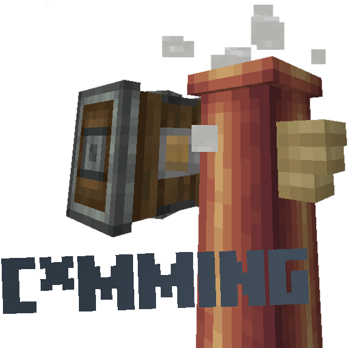 |  |  |
|  |  | 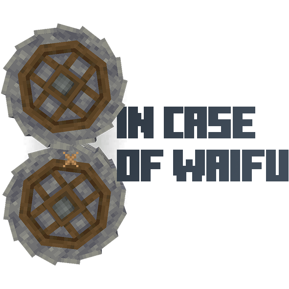 |
|  | 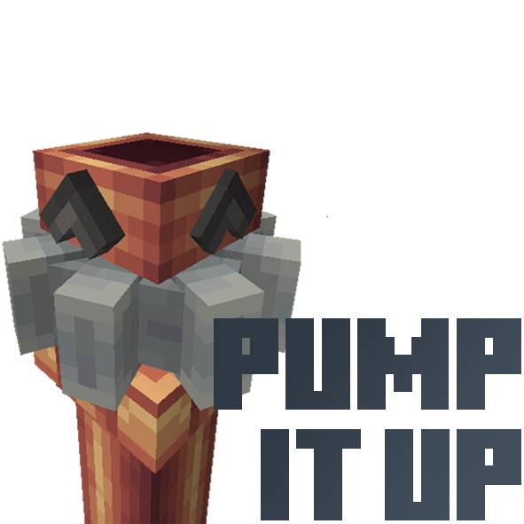 |  |
|  |  | 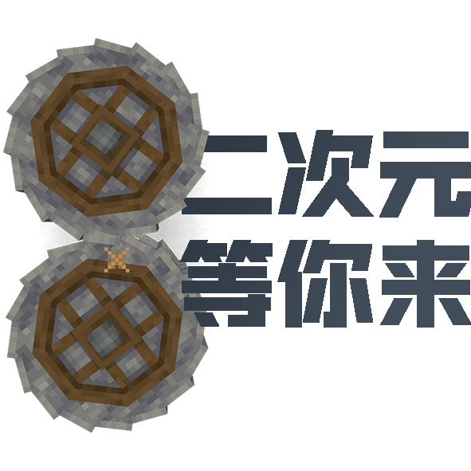 |
|  | 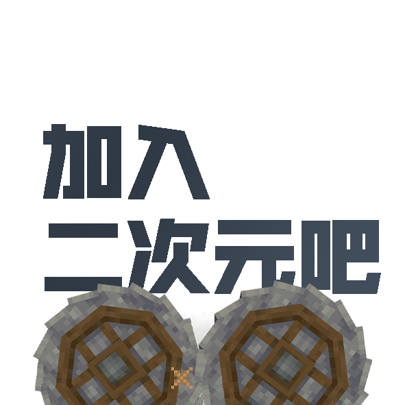 | 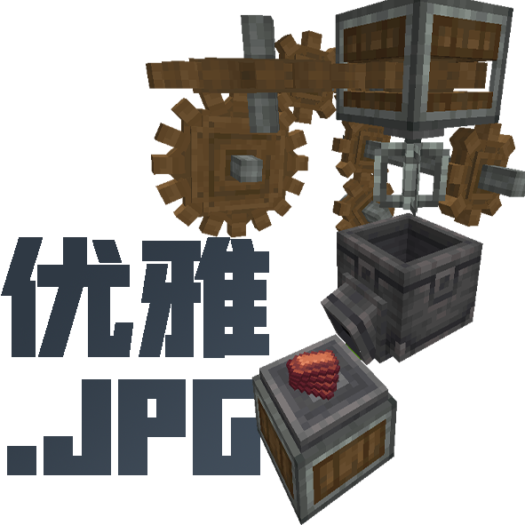 |
|  |  |  |
| 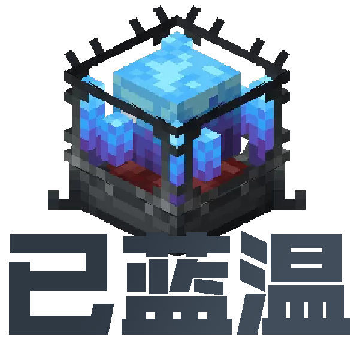 |  |  |
|  |  |  |
|  |  | 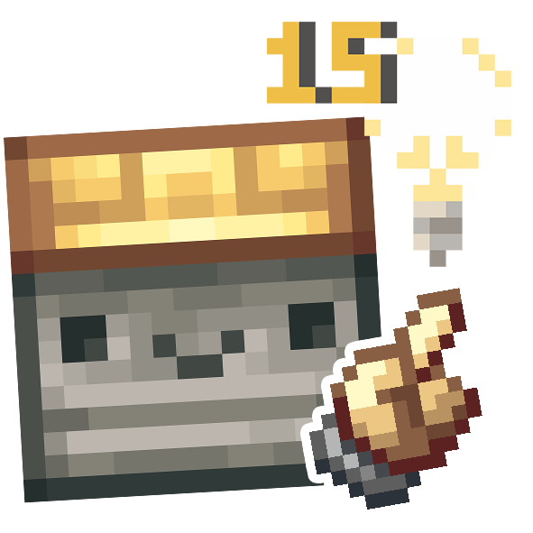 |
|  |  |  |
|  |  | 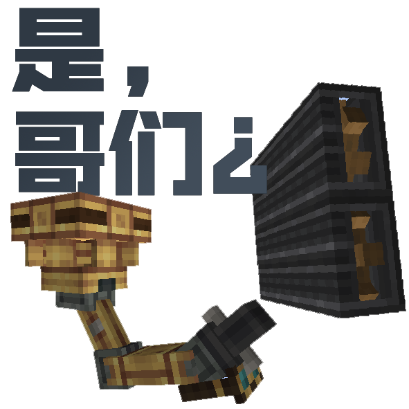 |
|  |  |  |
|  |  | 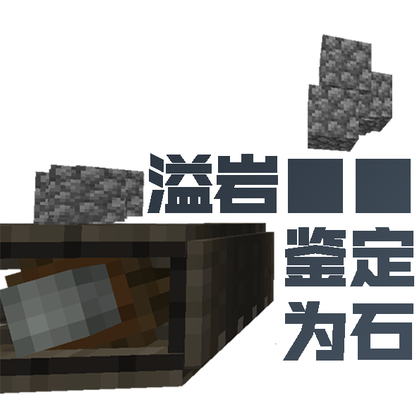 |
| 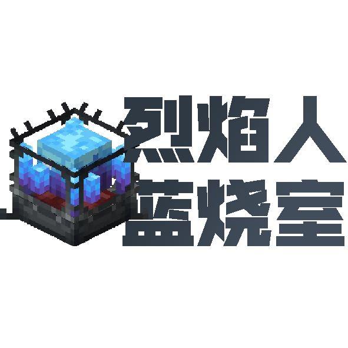 |  |  |
| 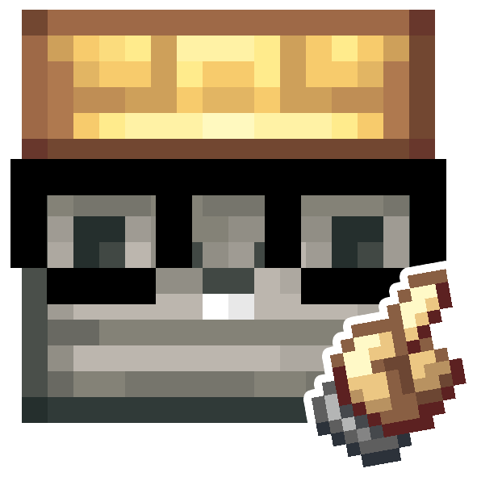 |  |  |
|  |  | 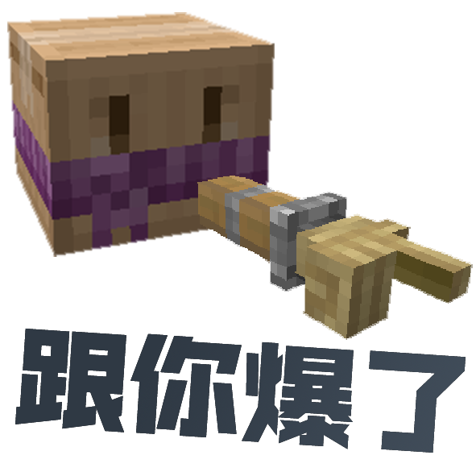 |
|  |  |  |
|  |  | 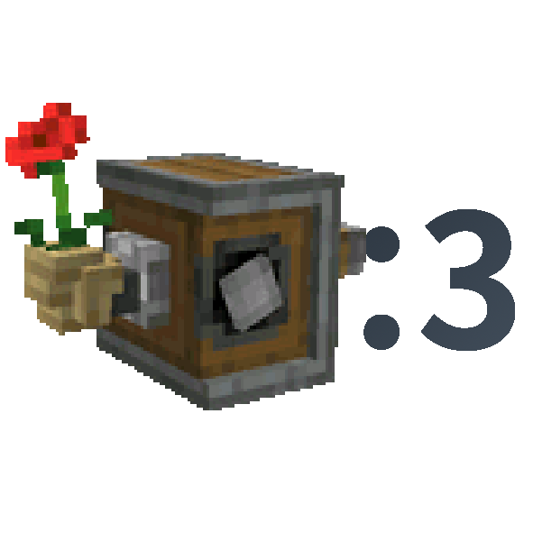 |
|  | | |